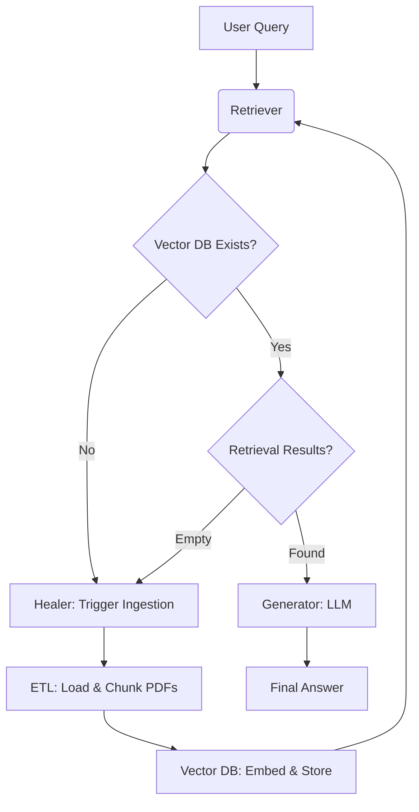

# Self-Healing RAG with Local Ollama Models

<p align="center">
  
</p>

  

## 📖 About the Project

**Self-Healing RAG** is a robust, privacy-first Retrieval-Augmented Generation system designed to run entirely locally. It empowers users to chat with their PDF documents without sending data to the cloud.

What sets this project apart is its **"Self-Healing"** architecture. The system proactively detects runtime failures—such as missing vector indices or empty retrieval results—and automatically triggers corrective actions (like re-ingestion or re-indexing) to ensure seamless operation.

## ✨ Key Features

-   **🔒 100% Local & Private**: Powered by [Ollama](https://ollama.com/), utilizing `phi3:mini` for generation and `nomic-embed-text` for embeddings. No data ever leaves your machine.
-   **🩺 Self-Healing Mechanism**:
    -   **Auto-Recovery**: Detects missing or corrupt Vector DBs and rebuilds them on the fly.
    -   **Smart Retrieval**: If a search yields zero results, the system infers a sync issue and re-indexes the document corpus.
-   **📄 Automated Ingestion**: Simply drop PDFs into the `data/` folder, and the system handles text extraction, chunking, and embedding automatically.
-   **🚀 Cost-Free**: Runs on consumer hardware with zero API costs.

## 🏗️ System Architecture

The following diagram illustrates the data flow and the self-healing loop:



### Components
-   **ETL Pipeline**:
    -   `loader.py`: Uses `PyPDFLoader` to extract raw text from PDFs.
    -   `chunker.py`: Splits text into semantic chunks (1000 chars) with overlap.
-   **Vector Store**:
    -   Uses **ChromaDB** to store `nomic-embed-text` embeddings locally.
-   **RAG Engine**:
    -   **Retriever**: Performs similarity search to find relevant context.
    -   **Generator**: Uses `phi3:mini` to synthesize answers based *only* on retrieved data.
-   **Healer**: Monitors the pipeline and repairs state (e.g., re-running ETL) when errors occur.

## 🚀 Getting Started

### Prerequisites

-   **Python 3.10+** installed.
-   **Ollama** installed and running. [Download here](https://ollama.com/).

### Installation

1.  **Clone the Repository**
    ```bash
    git clone https://github.com/0011Ashwin/Self-healing-RAG.git
    cd Self-healing-RAG
    ```

2.  **Install Dependencies**
    ```bash
    pip install -r requirements.txt
    ```

3.  **Setup Local Models**
    Pull the required models using Ollama:
    ```bash
    ollama pull phi3:mini
    ollama pull nomic-embed-text
    ```

## 💻 Usage

1.  **Add Documents**: Place your PDF files into the `data/` directory.
2.  **Run the Application**:
    ```bash
    python main.py
    ```
3.  **Interact**:
    -   The system will initialize (and self-heal/ingest if needed).
    -   Type your question when prompted.
    -   Type `exit` or `quit` to end the session.

## 📂 File Structure

```text
Self-healing-RAG/
├── data/                  # 📂 Drop your PDFs here
├── etl/                   # ⚙️ Extraction & Processing
│   ├── loader.py
│   └── chunker.py
├── modules/               # 🧠 Core Logic
│   ├── healing.py         # Self-healing orchestration
│   ├── vector_db.py       # ChromaDB interactions
│   ├── retriever.py       # Search logic
│   └── generator.py       # LLM generation
├── vectorstore/           # 💾 Persistent Vector DB
├── logs/                  # 📝 Application logs
├── main.py                # 🚀 Entry point
├── requirements.txt       # 📦 Dependencies
└── README.md              # 📖 Documentation
```

## 🔮 Roadmap & Contributing

We welcome contributions, especially from GSoC participants! Here are some ideas for future improvements:

-   **UI Implementation**: Build a web interface using Streamlit or Chainlit to replace the CLI.
-   **Advanced Healing**: Implement "Hypothetical Document Embeddings" (HyDE) or query rewriting when retrieval is poor.
-   **Model Swapping**: Add a config option to easily switch between models (e.g., `mistral`, `llama3`).
-   **Docker Support**: Containerize the application for easier deployment.

### How to Contribute
1.  Fork the repository.
2.  Create a feature branch (`git checkout -b feature/AmazingFeature`).
3.  Commit your changes (`git commit -m 'Add some AmazingFeature'`).
4.  Push to the branch (`git push origin feature/AmazingFeature`).
5.  Open a Pull Request.

## 📄 License

Distributed under the MIT License. See `LICENSE` for more information.

## 📞 Contact

Project Maintainer - [0011Ashwin](https://github.com/0011Ashwin)
Project Link: [https://github.com/0011Ashwin/Self-Healing-RAG-with-Local-Ollama-Models](https://github.com/0011Ashwin/Self-Healing-RAG-with-Local-Ollama-Models)
